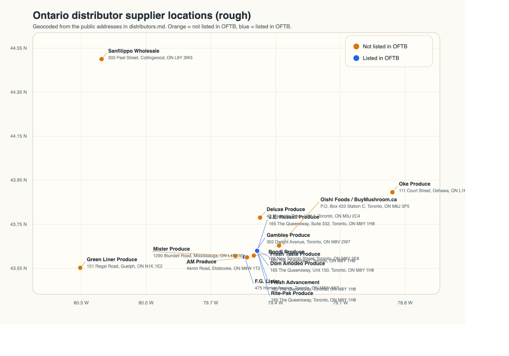

# Ontario Mushroom Buyer Leads: Distributors and Wholesalers

Checked on April 12, 2026 using supplier public websites, Ontario Food Terminal Board seller pages, and a small number of public directory/contact pages where the supplier site did not publish a street address.

This file only includes companies that look like potential buyers for an Ontario shiitake and oyster mushroom farm.

## Summary Table

Current operating constraint: because we already sell to Gambles Produce, treat OFTB-listed distributors as excluded outreach targets unless that commercial constraint changes.

## Rough Location Map

Vector version: [distributor_locations.svg](distributor_locations.svg)

### Not Listed In OFTB

| Supplier                                                                | Buyer Priority | Location                                                                                                                                                                                                           | Region / Coverage                                                                                                                                              | Buyer Signal                                                                                                                                                                                                          | Provided Mushroom                                                                                                                                                                                              | Phone Number                | Email Address                                           | Henry's note                                                    |
| ----------------------------------------------------------------------- | -------------- | ------------------------------------------------------------------------------------------------------------------------------------------------------------------------------------------------------------------ | -------------------------------------------------------------------------------------------------------------------------------------------------------------- | --------------------------------------------------------------------------------------------------------------------------------------------------------------------------------------------------------------------- | -------------------------------------------------------------------------------------------------------------------------------------------------------------------------------------------------------------- | --------------------------- | ------------------------------------------------------- | --------------------------------------------------------------- |
| [Oke Produce](https://okeproduce.ca/restaurants/)                       | High           | [Map](https://www.google.com/maps/search/?api=1&query=Oke+Produce+111+Court+Street+Oshawa+ON); 111 Court Street, Oshawa, ON L1H 4W5 ([source](https://okeproduce.ca/service-locations/))                           | Toronto, Durham Region, Barrie, Peterborough, Scarborough, Kingston, and broader Ontario delivery ([source](https://okeproduce.ca/service-locations/))         | Wholesale food distributor serving restaurants, hotels, care homes, child care, and small grocers ([source](https://okeproduce.ca/restaurants/))                                                                      | Button, cremini, portabella, shiitake, sliced, utility ([source](https://okeproduce.ca/our-products/))                                                                                                         | 437-339-3893 / 647-985-0071 | `sales@okeproduce.ca`                                   | called. They have shiitake. Currently no oyster, but can get it |
| [Oishi Foods / BuyMushroom.ca](https://buymushroom.ca/)                 | High           | [Map](https://www.google.com/maps/search/?api=1&query=Oishi+Foods+BuyMushroom.ca+Toronto+ON); P.O. Box 433 Station C, Toronto, ON M6J 3P5 ([source](https://buymushroom.ca/))                                      | Toronto and the GTA; product sourced directly from local farms in Southern Ontario ([source](https://buymushroom.ca/))                                         | Wholesale delivery service for independent grocery stores, restaurants, and catering companies ([source](https://buymushroom.ca/))                                                                                    | Oyster, shiitake, maitake; also white, cremini, portobello, lion's mane, enoki, honey, king oyster, chanterelle, morel, and dry porcini ([source](https://buymushroom.ca/products))                            | 416-702-9456                | Not publicly listed                                     | yes. $32/3lb for shiitake  $34/3lb for oyster             |
| [Bondi Produce](https://bondiproduce.com/)                              | High           | [Map](https://www.google.com/maps/search/?api=1&query=Bondi+Produce+188+New+Toronto+Street+Toronto+ON); 188 New Toronto Street, Toronto, ON M8V 2E8 ([source](https://bondiproduce.com/))                          | Southern Ontario, with Toronto and Ottawa operations and delivery across Ontario ([source](https://bondiproduce.com/))                                         | Wholesale and value-added produce and specialty food distributor serving restaurants, hospitality, retail, catering, schools, hospitals, and stadiums ([source](https://bondiproduce.com/))                           | Bondi's public market-report channel is the current place where specialty fungi appear; no current public SKU page found ([source](https://info.bondiproduce.com/market-reports))                              | 416-251-1300                | `info@bondiproduce.com`                                 | From their web page, they seem to have shiitake                 |
| [Green Liner Produce](https://www.greenlinerproduce.ca/produce)         | High           | [Map](https://www.google.com/maps/search/?api=1&query=Green+Liner+Produce+151+Regal+Road+Guelph+ON); 151 Regal Road, Guelph, ON N1K 1E2 ([source](https://www.greenlinerproduce.ca/))                              | Southwestern Ontario, including Guelph, Kitchener-Waterloo, Cambridge, London, Burlington, Hamilton, and the GTA ([source](https://www.greenlinerproduce.ca/)) | Wholesale produce supplier serving restaurants, universities, health care, catering, hotels, small retail, culinary schools, franchise groups, and buying groups ([source](https://www.greenlinerproduce.ca/produce)) | Whole #1, button, sliced, shiitake, cremini, oyster, portobello, honey, and shimeji ([source](https://www.greenlinerproduce.ca/_files/ugd/ba2cd3_ecf6673e43604e178cec3c4a3c25294e.pdf))                        | 519-829-4801                | `office@greenliner.ca`                                  | They sell both shiitake and oyster mushroom                     |
| [Sanfilippo Wholesale](https://sanfilippowholesale.ca/index.php/about/) | Medium         | [Map](https://www.google.com/maps/search/?api=1&query=Sanfilippo+Wholesale+333+Peel+Street+Collingwood+ON); 333 Peel Street, Collingwood, ON L9Y 3W3 ([source](https://sanfilippowholesale.ca/index.php/contact/)) | Collingwood, Georgian Bay, and surrounding communities ([source](https://sanfilippowholesale.ca/index.php/about/))                                             | Wholesale produce distributor serving restaurants, retailers, resort, and institutional businesses ([source](https://sanfilippowholesale.ca/index.php/about/))                                                        | #1, #2, button, cremini, king, honey, oyster, portobello, shiitake, and sliced ([source](https://sanfilippowholesale.ca/index.php/fruits-vegetables/))                                                         | 705-445-4200                | Not publicly listed                                     |                                                                 |
| [Mister Produce](https://www.misterproduce.com/)                        | Medium         | [Map](https://www.google.com/maps/search/?api=1&query=Mister+Produce+1290+Blundell+Road+Mississauga+ON); 1290 Blundell Road, Mississauga, ON L4Y 1M5 ([source](https://www.misterproduce.com/contact-us/))         | Ontario foodservice market ([source](https://www.misterproduce.com/))                                                                                          | One of Ontario's largest privately owned fresh food distributors serving restaurants, hotels, caterers, schools, universities, sports venues, and institutions ([source](https://www.misterproduce.com/))             | White, brown, button, shiitake, and portobello from the public home-delivery product list PDF ([source](https://www.misterproduce.com/wp-content/uploads/2024/08/MisterProduce_HomeDelivery_ProductsList.pdf)) | 416-252-9191                | `misterproduce@ica.net`                                 |                                                                 |
| [Deluxe Produce](https://deluxeproduce.com/)                            | Medium         | [Map](https://www.google.com/maps/search/?api=1&query=Deluxe+Produce+40+Magnetic+Drive+Toronto+ON); 40 Magnetic Drive, Unit 1, Toronto, ON M3J 2C4 ([source](https://deluxeproduce.com/))                          | GTA ([source](https://deluxeproduce.com/))                                                                                                                     | B2B wholesale produce supplier serving restaurants, hotels, caterers, schools, healthcare, and grocery chains with daily GTA delivery ([source](https://deluxeproduce.com/))                                          | Cremini mushrooms are publicly named on the homepage SKU stream; no broader public mushroom assortment page found ([source](https://deluxeproduce.com/))                                                       | 416-356-4420                | `orderdesk@deluxeproduce.com`; `info@deluxeproduce.com` |                                                                 |
| [AM Produce](https://www.amproduce.ca/)                                 | Low            | [Map](https://www.google.com/maps/search/?api=1&query=AM+Produce+Akron+Road+Etobicoke+ON); Akron Road, Etobicoke, ON M8W 1T2 ([source](https://www.amproduce.ca/about/))                                           | GTA and Ontario wholesale coverage ([source](https://www.amproduce.ca/about/))                                                                                 | Produce wholesaler and distributor serving restaurants, manufacturing plants, juice businesses, and other wholesale buyers ([source](https://www.amproduce.ca/about/))                                                | No current public mushroom assortment found on the public pages checked ([source](https://www.amproduce.ca/about/))                                                                                            | 647-308-1895                | `info@amproduce.ca`; `homedeliveries@amproduce.ca`      |                                                                 |

### Listed In OFTB

Reference only under the current Gambles relationship.

| Supplier | Buyer Priority | Location | Region / Coverage | Buyer Signal | Provided Mushroom | Phone Number | Email Address | Henry's note |
|---|---|---|---|---|---|---|---|---|
| [J.E. Russell Produce](https://www.jerussell.ca/wholesale-produce-toronto/) | High | [Map](https://www.google.com/maps/search/?api=1&query=JE+Russell+Produce+165+The+Queensway+Suite+332+Toronto+ON); 165 The Queensway, Suite 332, Toronto, ON M8Y 1H8 ([source](https://www.jerussell.ca/contact-us/)) | Central Ontario and neighbouring markets ([source](https://www.jerussell.ca/contact-us/)) | Produce distributor serving independent retailers, chain stores, and food service ([source](https://www.jerussell.ca/contact-us/)) | Shiitake, oyster, maitake; also enoki, honey, portobello, white, and brown ([source](https://www.jerussell.ca/holy-shiitake/)) | 416-252-7838 | `info@jerussell.ca` |  |
| [Gambles Produce](https://www.goproduce.com/) | High | [Map](https://www.google.com/maps/search/?api=1&query=Gambles+Produce+302+Dwight+Avenue+Toronto+ON); 302 Dwight Avenue, Toronto, ON M8V 2W7 ([source](https://www.goproduce.com/contact-us)) | GTA and Ontario, with customers across Canada and western coverage via Calgary ([source](https://www.goproduce.com/)) | Fresh produce supplier sourcing, importing, packaging, and distributing to wholesale, retail, and foodservice customers ([source](https://www.goproduce.com/)) | Mushrooms publicly listed; OFTB seller page confirms mushrooms in the assortment ([source](https://www.oftb.com/sellers/gambles-produce-inc)) | 416-259-6397 | `customer.service@goproduce.com` |  |
| [Fresh Taste Produce](https://freshtasteproduce.com/about-us/) | Medium | [Map](https://www.google.com/maps/search/?api=1&query=Fresh+Taste+Produce+165+The+Queensway+Toronto+ON); 165 The Queensway, Toronto, ON M8Y 1H8 ([source](https://freshtasteproduce.com/contact-us/)) | Ontario commercial distribution programs backed by a global grower and logistics network ([source](https://freshtasteproduce.com/worldwide-grower-network/)) | Multifaceted produce company involved in growing, packing, importing, processing, distributing, and delivery to commercial and independent partners ([source](https://freshtasteproduce.com/about-us/)) | Enoki Mushroom; site also says it can source unique products through its global produce network ([source](https://freshtasteproduce.com/worldwide-grower-network/)) | 416-255-0157 | `sales@freshtasteproduce.com` |  |
| [Dom Amodeo Produce](https://www.domamodeoproduce.com/about-us/) | Medium | [Map](https://www.google.com/maps/search/?api=1&query=Dom+Amodeo+Produce+165+The+Queensway+Unit+150+Toronto+ON); 165 The Queensway, Ontario Food Terminal Unit 150, Toronto, ON M8Y 1H8 ([source](https://www.domamodeoproduce.com/shop/)) | GTA, Central Ontario, and Southwestern Ontario; deliveries 7 days a week ([source](https://www.domamodeoproduce.com/about-us/)) | Long-running produce distributor serving business customers from the Ontario Food Terminal ([source](https://www.domamodeoproduce.com/about-us/)) | Mushrooms listed on the OFTB seller page; the current official site does not break out public mushroom varieties ([source](https://www.oftb.com/sellers/amodeo-produce)) | 416-252-1121 | `info@amodeoproduce.com` |  |
| [F.G. Lister](https://www.fglister.ca/) | Medium | [Map](https://www.google.com/maps/search/?api=1&query=FG+Lister+475+Horner+Avenue+Toronto+ON); 475 Horner Avenue, Toronto, ON M8W 4X7 ([source](https://www.fglister.ca/contact.html)) | Southern Ontario and Quebec ([source](https://www.fglister.ca/)) | Importer and wholesaler serving wholesale, foodservice, and retail sectors ([source](https://www.fglister.ca/)) | Mushrooms listed on the OFTB seller page; the current official site does not break out public mushroom varieties ([source](https://www.oftb.com/sellers/f-g-lister-co-ltd)) | 416-259-7621 | `info@fglister.com` |  |
| [Fresh Advancement](https://faproduce.com/) | Medium | [Map](https://www.google.com/maps/search/?api=1&query=Fresh+Advancements+165+The+Queensway+Toronto+ON); Ontario Food Terminal, 165 The Queensway, Toronto, ON M8Y 1H8 ([source](https://faproduce.com/contact-us/)) | London west, Kingston east, Bracebridge north, and Niagara Falls south ([source](https://faproduce.com/)) | Large produce distributor and importer serving food service distributors, major retailers, and independent restaurateurs ([source](https://faproduce.com/)) | Mushrooms listed on the OFTB seller page; the current official site does not name mushroom varieties ([source](https://www.oftb.com/sellers/fresh-advancements-inc)) | 416-259-5479 | Not publicly listed |  |
| [Rite-Pak Produce](https://www.burnacproduce.com/our-operation/divisions.html) | Medium | [Map](https://www.google.com/maps/search/?api=1&query=Rite-Pak+Produce+165+The+Queensway+Toronto+ON); Ontario Food Terminal, 165 The Queensway, Toronto, ON M8Y 1H8 ([source](https://www.burnacproduce.com/our-operation/divisions.html)) | Toronto / Ontario Food Terminal, with customers across Canada and the U.S. ([source](https://www.burnacproduce.com/our-operation/divisions.html)) | Major importer and distributor focused on vegetables, berries, and Italian products for retail and foodservice supply ([source](https://www.burnacproduce.com/our-operation/divisions.html)) | Mushrooms listed on the OFTB seller page; the official division page does not publish mushroom varieties ([source](https://www.oftb.com/sellers/rite-pak-produce-co-ltd)) | 416-252-3121 | `info@rite-pakproduce.com` |  |

## Suggested Outreach Order

- Wave 1:
  - Oishi Foods / BuyMushroom.ca
  - Green Liner Produce
  - Oke Produce
  - Bondi Produce
  Reason: These are the highest-priority non-OFTB distributor targets under the current Gambles relationship and also have the strongest current public mushroom evidence.
- Wave 2:
  - Sanfilippo Wholesale
  - Mister Produce
  - Deluxe Produce
  Reason: These remain viable non-OFTB distributor leads, but the public mushroom evidence is either generic, indirect, or weaker than the Wave 1 group.
- Wave 3:
  - AM Produce
  Reason: The company clearly fits the distributor model, but I could not confirm a current public mushroom assortment, so it is better treated as a lower-confidence prospect.
- Excluded under current OFTB constraint:
  - J.E. Russell Produce
  - Gambles Produce
  - Fresh Taste Produce
  - Dom Amodeo Produce
  - F.G. Lister
  - Fresh Advancement
  - Rite-Pak Produce
  Reason: These suppliers are listed in the current Ontario Food Terminal directory and should be treated as reference-only unless the current Gambles-related constraint changes.

## Similar Buyer Models

These are the closest distributor-style buyer models in this research set: companies that source from growers or suppliers, then resell into restaurants, grocery, retail, or foodservice.

- [Bondi Produce](https://bondiproduce.com/): Chef-focused Ontario foodservice distributor with public mushroom mentions in market reports.
- [Deluxe Produce](https://deluxeproduce.com/): GTA-focused B2B produce distributor with public cremini mushroom evidence and clear restaurant / institutional coverage.
- [Dom Amodeo Produce](https://www.domamodeoproduce.com/about-us/): Central and Southwestern Ontario produce distributor with Ontario Food Terminal presence and broad business delivery coverage.
- [Gambles Produce](https://www.goproduce.com/): Broad Ontario produce wholesaler with mushrooms publicly listed year-round.
- [Green Liner Produce](https://www.greenlinerproduce.ca/produce): Southwestern Ontario produce wholesaler with one of the clearest public mushroom item lists in this research set.
- [Sanfilippo Wholesale](https://sanfilippowholesale.ca/index.php/fruits-vegetables/): Regional produce distributor with a strong public mushroom assortment.
- [J.E. Russell Produce](https://www.jerussell.ca/wholesale-produce-toronto/): Broad produce distributor with unusually strong public mushroom visibility.
- [Oke Produce](https://okeproduce.ca/restaurants/): Broad foodservice produce wholesaler serving restaurants and hospitality accounts across Ontario.
- [Mister Produce](https://www.misterproduce.com/): Large Ontario foodservice distributor with weaker but still public mushroom evidence.

## Notes

- Prioritize buyers with current public mushroom listings or recent public market mentions: Oke, J.E. Russell, Oishi, Gambles, Bondi, and Green Liner.
- Confirm live SKU availability before outreach where the current public mushroom evidence is generic or indirect, especially for Mister Produce, Deluxe Produce, Dom Amodeo Produce, F.G. Lister, Fresh Advancement, and Rite-Pak Produce.
- Treat AM Produce as a lower-confidence lead until you can confirm a current mushroom assortment with their sales team.
- For several added leads, Ontario Food Terminal Board seller pages were needed to verify that mushrooms are part of the assortment because the current company site does not publish a detailed mushroom category.
- Only mushroom types explicitly visible on public pages are marked as verified in this file.
- A few suppliers do not publish a direct email address on their current public pages; those cells are marked `Not publicly listed` instead of guessing.
- Because we already sell to Gambles Produce, current Ontario Food Terminal-listed distributors are separated for reference and not treated as active outreach targets in this file.
