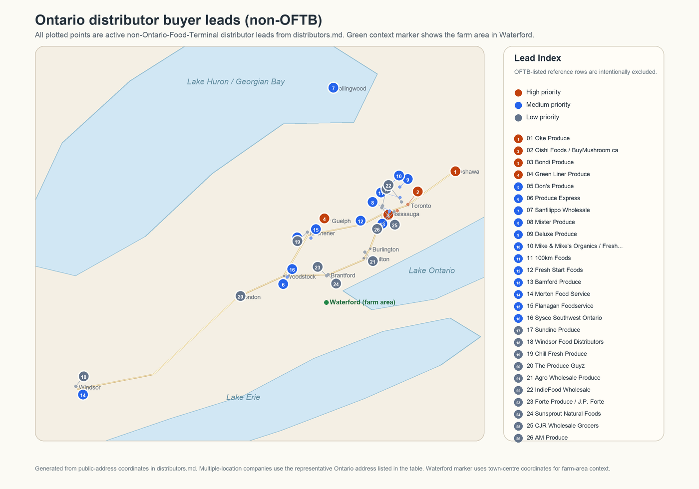

# Ontario Mushroom Buyer Leads: Distributors and Wholesalers

Checked on April 12, 2026 using supplier public websites, Ontario Food Terminal Board seller pages, and a small number of public directory/contact pages where the supplier site did not publish a street address. Expanded on April 28, 2026 with additional non-OFTB distributor and distributor-like channels, including a Southwestern Ontario scan, then filtered to keep only distributors with Ontario locations. Updated on May 5, 2026 with DiLiso's Fresh 2U Produce, Bamford Produce / Fresh Advancements, and a non-OFT list audit for Ontario Food Terminal operations.

This file only includes Ontario-based or Ontario-located companies that look like potential buyers for an Ontario shiitake and oyster mushroom farm. Out-of-province distributors are intentionally excluded, even when they have national coverage or a possible Ontario sales territory.

## Summary Table

Current operating constraint: because we already sell to Gambles Produce, treat OFTB-listed or confirmed Ontario Food Terminal-operating distributors as excluded outreach targets unless that commercial constraint changes.

Ontario-location filter: every distributor listed below has an Ontario address, Ontario branch, or Ontario Food Terminal presence. This is now an Ontario-only lead file.

## Rough Location Map



Map note: this is a north-up Ontario-only rough map of the active distributor leads in the first table. It intentionally excludes the OFTB-listed and confirmed Ontario Food Terminal-operating reference-only buyers because of the current Gambles relationship. Use the table map links for exact lead-by-lead locations. The point data and published map image are in `resources/`; generator scratch files are written under `../temp/distribution/distributor-map/`.

### Not Confirmed Operating In OFT

```base
filters:
  and:
    - file.inFolder("distribution/distributor-leads/not-confirmed-operating-in-oft")
    - lead_section == "not-confirmed-operating-in-oft"
formulas:
  supplier: link(website, supplier_name)
  map: link(map_url, "Map")
properties:
  formula.supplier:
    displayName: Supplier
  buyer_priority:
    displayName: Buyer Priority
  outreach_wave:
    displayName: Outreach Wave
  formula.map:
    displayName: Map
  location:
    displayName: Location
  region_coverage:
    displayName: Region / Coverage
  buyer_signal:
    displayName: Buyer Signal
  provided_mushroom:
    displayName: Provided Mushroom
  phone:
    displayName: Phone Number
  email:
    displayName: Email Address
  note:
    displayName: Note
  henry_note:
    displayName: Henry's Note
  alive:
    displayName: Alive
views:
  - type: table
    name: Not Confirmed Operating In OFT
    filters:
      and:
        - alive == true
    order:
      - formula.supplier
      - buyer_priority
      - henry_note
      - alive
      - outreach_wave
      - formula.map
      - location
      - region_coverage
      - buyer_signal
      - provided_mushroom
      - phone
      - email
      - note.note
    sort:
      - property: formula.supplier
        direction: ASC
      - property: buyer_priority
        direction: DESC
      - property: alive
        direction: DESC
      - property: henry_note
        direction: DESC
      - property: outreach_wave
        direction: ASC
    rowHeight: extra

```

### Listed / Operating In OFT

Reference only under the current Gambles relationship. Rows in this section are either OFTB seller-page matches or companies with credible public / field evidence of Ontario Food Terminal-based operations.

| Supplier | Buyer Priority | Location | Region / Coverage | Buyer Signal | Provided Mushroom | Phone Number | Email Address | Note | Henry's note |
|---|---|---|---|---|---|---|---|---|---|
| [J.E. Russell Produce](https://www.jerussell.ca/wholesale-produce-toronto/) | High | [Map](https://www.google.com/maps/search/?api=1&query=JE+Russell+Produce+165+The+Queensway+Suite+332+Toronto+ON); 165 The Queensway, Suite 332, Toronto, ON M8Y 1H8 ([source](https://www.jerussell.ca/contact-us/)) | Central Ontario and neighbouring markets ([source](https://www.jerussell.ca/contact-us/)) | Produce distributor serving independent retailers, chain stores, and food service ([source](https://www.jerussell.ca/contact-us/)) | Shiitake, oyster, maitake; also enoki, honey, portobello, white, and brown ([source](https://www.jerussell.ca/holy-shiitake/)) | 416-252-7838 | `info@jerussell.ca` |  |  |
| [Gambles Produce](https://www.goproduce.com/) | High | [Map](https://www.google.com/maps/search/?api=1&query=Gambles+Produce+302+Dwight+Avenue+Toronto+ON); 302 Dwight Avenue, Toronto, ON M8V 2W7 ([source](https://www.goproduce.com/contact-us)) | Ontario-based distributor serving the GTA and Ontario, with customers across Canada and western coverage via Calgary ([source](https://www.goproduce.com/)) | Fresh produce supplier sourcing, importing, packaging, and distributing to wholesale, retail, and foodservice customers ([source](https://www.goproduce.com/)) | Mushrooms publicly listed; OFTB seller page confirms mushrooms in the assortment ([source](https://www.oftb.com/sellers/gambles-produce-inc)) | 416-259-6397 | `customer.service@goproduce.com` |  |  |
| [Fresh Taste Produce](https://freshtasteproduce.com/about-us/) | Medium | [Map](https://www.google.com/maps/search/?api=1&query=Fresh+Taste+Produce+165+The+Queensway+Toronto+ON); 165 The Queensway, Toronto, ON M8Y 1H8 ([source](https://freshtasteproduce.com/contact-us/)) | Ontario commercial distribution programs backed by a global grower and logistics network ([source](https://freshtasteproduce.com/worldwide-grower-network/)) | Multifaceted produce company involved in growing, packing, importing, processing, distributing, and delivery to commercial and independent partners ([source](https://freshtasteproduce.com/about-us/)) | Enoki Mushroom; site also says it can source unique products through its global produce network ([source](https://freshtasteproduce.com/worldwide-grower-network/)) | 416-255-0157 | `sales@freshtasteproduce.com` |  |  |
| [Dom Amodeo Produce](https://www.domamodeoproduce.com/about-us/) | Medium | [Map](https://www.google.com/maps/search/?api=1&query=Dom+Amodeo+Produce+165+The+Queensway+Unit+150+Toronto+ON); 165 The Queensway, Ontario Food Terminal Unit 150, Toronto, ON M8Y 1H8 ([source](https://www.domamodeoproduce.com/shop/)) | GTA, Central Ontario, and Southwestern Ontario; deliveries 7 days a week ([source](https://www.domamodeoproduce.com/about-us/)) | Long-running produce distributor serving business customers from the Ontario Food Terminal ([source](https://www.domamodeoproduce.com/about-us/)) | Mushrooms listed on the OFTB seller page; the current official site does not break out public mushroom varieties ([source](https://www.oftb.com/sellers/amodeo-produce)) | 416-252-1121 | `info@amodeoproduce.com` |  |  |
| [F.G. Lister](https://www.fglister.ca/) | Medium | [Map](https://www.google.com/maps/search/?api=1&query=FG+Lister+475+Horner+Avenue+Toronto+ON); 475 Horner Avenue, Toronto, ON M8W 4X7 ([source](https://www.fglister.ca/contact.html)) | Ontario-based distributor serving Southern Ontario and Quebec ([source](https://www.fglister.ca/)) | Importer and wholesaler serving wholesale, foodservice, and retail sectors ([source](https://www.fglister.ca/)) | Mushrooms listed on the OFTB seller page; the current official site does not break out public mushroom varieties ([source](https://www.oftb.com/sellers/f-g-lister-co-ltd)) | 416-259-7621 | `info@fglister.com` |  |  |
| [Produce Express](https://produceexpress.ca/wholesale/) | Medium | Main office: [Map](https://www.google.com/maps/search/?api=1&query=Produce+Express+1149+Commerce+Way+Woodstock+ON); 1149 Commerce Way, Woodstock, ON N4V 0A2 ([source](https://produceexpress.ca/contact-us/)); OFT buyer role: Etobicoke, ON M8Y 1H8 ([job source](https://ca.indeed.com/viewjob?jk=9b998695ea121844)) | Southwestern Ontario, including Oxford, Norfolk, Elgin, Brant, Perth, London-Middlesex, and surrounding areas ([source](https://ca.linkedin.com/company/produce-express-inc)) | Wholesale produce supplier for restaurants, businesses, schools, and organizations across Southwestern Ontario; a current Produce Express Category Buyer posting says the role is based out of the Ontario Food Terminal and works with procurement and sales teams ([source](https://produceexpress.ca/wholesale/); [job source](https://ca.indeed.com/viewjob?jk=9b998695ea121844)) | No public shiitake or mushroom assortment found on pages checked ([source](https://produceexpress.ca/wholesale/)) | 519-539-9333 / 519-670-2996 | Not publicly listed | Moved from active non-OFT list on May 5, 2026 after finding an OFT-based buyer role. No OFTB seller page found under Produce Express; confirm whether this is buyer-desk-only or a terminal tenant before making a final commercial call. | failed, just say they're okay... |
| [Deluxe Produce / Art Farms](https://deluxeproduce.com/) | Medium | Deluxe office: [Map](https://www.google.com/maps/search/?api=1&query=Deluxe+Produce+40+Magnetic+Drive+Toronto+ON); 40 Magnetic Drive, Unit 1, Toronto, ON M3J 2C4 ([source](https://deluxeproduce.com/)); OFT-linked Art Farms at Ontario Food Terminal ([public news source](https://thehighlander.ca/2025/05/22/twelve-mile-lake-to-still-feel-the-love/)) | GTA ([source](https://deluxeproduce.com/)) | B2B wholesale produce supplier serving restaurants, hotels, caterers, schools, healthcare, and grocery chains with daily GTA delivery; public news reports the same owner runs Art Farms in the Ontario Food Terminal and is also at the helm of Deluxe Produce ([source](https://deluxeproduce.com/); [public news source](https://thehighlander.ca/2025/05/22/twelve-mile-lake-to-still-feel-the-love/)) | Cremini mushrooms are publicly named on the homepage SKU stream; Henry's call note says they sell shiitake and have a farmer for shiitake, but no public shiitake SKU page was found ([source](https://deluxeproduce.com/)) | 416-356-4420 | `orderdesk@deluxeproduce.com`; `info@deluxeproduce.com` | Moved from active non-OFT list on May 5, 2026 after combining Henry's call note with public Art Farms / OFT ownership evidence. No OFTB seller page found under Deluxe Produce or Art Farms; confirm exact OFT seller name before treating as a direct OFTB seller. | called tuesday and friday (may 1) no one picking up.<br><br>They sell shiitake, but they're located in OFT! and they say they have a farmer for shiitake |
| [Fresh Advancements / Bamford Produce](https://bamfordproduce.com/) | Medium | [Map](https://www.google.com/maps/search/?api=1&query=Fresh+Advancements+165+The+Queensway+Toronto+ON); Ontario Food Terminal, 165 The Queensway, Toronto, ON M8Y 1H8 ([OFTB source](https://www.oftb.com/sellers/fresh-advancements-inc)); Bamford distribution office: [Map](https://www.google.com/maps/search/?api=1&query=Bamford+Produce+2501-A+Stanfield+Road+Mississauga+ON); 2501-A Stanfield Rd, Mississauga, ON L4Y 1R6 ([source](https://bamfordproduce.com/)) | London west, Kingston east, Bracebridge north, and Niagara Falls south ([Bamford source](https://bamfordproduce.com/); [Fresh Advancements source](https://faproduce.com/)) | OFTB lists Fresh Advancements with `www.bamfordproduce.com`; Bamford says the family acquired an Ontario Food Terminal stall in 2003 and expanded to three stalls, and describes Fresh Advancements and Bamford Produce as part of the same group ([OFTB source](https://www.oftb.com/sellers/fresh-advancements-inc); [Bamford source](https://bamfordproduce.com/about-us/)) | Mushrooms listed on the OFTB seller page; Bamford product pages list brown / cremini, sliced, oyster, and portobello mushrooms; no public shiitake SKU found ([OFTB source](https://www.oftb.com/sellers/fresh-advancements-inc); [Bamford source](https://bamfordproduce.com/our-products/)) | 416-259-5479; 905-615-9400 / 1-888-EAT-FRESH | `orders@bamfordproduce.com` | Moved from non-OFTB on May 5, 2026 after confirming the Bamford / Fresh Advancements Ontario Food Terminal connection. Reference-only under current Gambles constraint. | called 5.1 no one answers |
| [Rite-Pak Produce](https://www.burnacproduce.com/our-operation/divisions.html) | Medium | [Map](https://www.google.com/maps/search/?api=1&query=Rite-Pak+Produce+165+The+Queensway+Toronto+ON); Ontario Food Terminal, 165 The Queensway, Toronto, ON M8Y 1H8 ([source](https://www.burnacproduce.com/our-operation/divisions.html)) | Ontario Food Terminal distributor with customers across Canada and the U.S. ([source](https://www.burnacproduce.com/our-operation/divisions.html)) | Major importer and distributor focused on vegetables, berries, and Italian products for retail and foodservice supply ([source](https://www.burnacproduce.com/our-operation/divisions.html)) | Mushrooms listed on the OFTB seller page; the official division page does not publish mushroom varieties ([source](https://www.oftb.com/sellers/rite-pak-produce-co-ltd)) | 416-252-3121 | `info@rite-pakproduce.com` |  |  |

## Suggested Outreach Order

- Wave 1:
  - Oishi Foods / BuyMushroom.ca
  - Green Liner Produce
  - Oke Produce
  - Bondi Produce
  Reason: These are the highest-priority active distributor targets under the current Gambles relationship and also have the strongest current public mushroom evidence.
- Wave 2:
  - Don's Produce
  - Morton Food Service
  - Flanagan Foodservice
  - Sysco Southwest Ontario
  - Sanfilippo Wholesale
  - Mike & Mike's Organics / Fresh Direct Produce Group
  - 100km Foods
  - Fresh Start Foods
  - Gordon Food Service Ontario
  - Mister Produce
  Reason: These remain viable active Ontario distributor leads, but the fit is more conditional: Don's, Morton, Flanagan, Sysco, and Gordon Food Service have strong Southwestern Ontario or Ontario foodservice coverage but need mushroom SKU or supplier-program confirmation, Sanfilippo has an existing nearby mushroom source, 100km Foods is a strong local-food channel but needs live mushroom demand confirmation, Mike & Mike's and Fresh Start are broader produce distributors, and Mister needs live SKU confirmation.
- Wave 3:
  - IndieFood Wholesale
  - Sundine Produce
  - Agro Wholesale Produce
  - Windsor Food Distributors
  - Chill Fresh Produce
  - The Produce Guyz
  - Forte Produce / J.P. Forte
  - Sunsprout Natural Foods
  - CJR Wholesale Grocers
  - DiLiso's Fresh 2U Produce
  - AM Produce
  Reason: These are lower-confidence or channel-specific Ontario prospects. IndieFood is more of a farm-direct marketplace / cold-chain channel, Sundine is an Asian-produce distributor with no public mushroom evidence, Agro / Windsor / Chill Fresh / Forte / Sunsprout are produce or foodservice wholesaler leads with weak mushroom evidence, The Produce Guyz is a retail/wholesale produce-box channel, CJR is grocery/dairy rather than produce-specific, DiLiso's Fresh 2U is a GTA produce distributor with generic mushroom evidence but heavy Ontario Food Terminal sourcing, and AM Produce has already said it does not sell shiitake.
- Excluded under current OFT / OFTB constraint:
  - J.E. Russell Produce
  - Gambles Produce
  - Fresh Taste Produce
  - Dom Amodeo Produce
  - F.G. Lister
  - Produce Express
  - Deluxe Produce / Art Farms
  - Fresh Advancements / Bamford Produce
  - Rite-Pak Produce
  Reason: These suppliers are listed in the current Ontario Food Terminal directory or have credible evidence of Ontario Food Terminal-based operations and should be treated as reference-only unless the current Gambles-related constraint changes.

## Similar Buyer Models

These are the closest distributor-style buyer models in this Ontario-only research set: companies with Ontario locations that source from growers or suppliers, then resell into restaurants, grocery, retail, or foodservice.

- [100km Foods](https://wholesale.100kmfoods.com/): Toronto local-food distributor connecting Ontario farmers and producers with chefs, restaurants, hotels, sports teams, retail stores, and other food businesses; strong channel fit, but current shiitake/oyster demand needs confirmation.
- [Agro Wholesale Produce](https://www.yellowpages.ca/bus/Ontario/Burlington/Agro-Wholesale-Produce-Ltd/3611900.html): Burlington/Hamilton-area fruit and vegetable wholesaler for restaurants and institutions; mushroom fit needs confirmation.
- [Fresh Advancements / Bamford Produce](https://bamfordproduce.com/): OFTB-listed produce distributor group with London-to-Niagara coverage and public oyster / mainstream mushroom evidence; reference-only under the current Gambles constraint.
- [Bondi Produce](https://bondiproduce.com/): Chef-focused Ontario foodservice distributor with public mushroom mentions in market reports.
- [Chill Fresh Produce](https://chillfreshproduce.net/): Kitchener produce wholesale distributor lead; very sparse public information, so phone verification is essential.
- [CJR Wholesale Grocers](https://cjrwholesale.com/brantfords-leading-wholesale-distributor/): Brantford-serving wholesale grocery distributor; use only for grocery-channel exploration because it is not produce-specific.
- [Deluxe Produce / Art Farms](https://deluxeproduce.com/): GTA-focused B2B produce distributor with public cremini mushroom evidence and OFT-linked ownership / field-note evidence; reference-only until the exact OFT seller relationship is confirmed.
- [DiLiso's Fresh 2U Produce](https://www.dilisosfresh2uproduce.com/): GTA wholesale produce distributor serving grocery, foodservice, casinos, hotels, and retirement homes; include as a low-confidence verification call because the public list says mushrooms generically but not shiitake or oyster.
- [Don's Produce](https://donsproduce.net/): Petersburg-based Southwestern Ontario produce wholesaler serving grocery, institutional, and restaurant customers; good Brantford-area call even though public mushroom evidence is not visible.
- [Dom Amodeo Produce](https://www.domamodeoproduce.com/about-us/): Central and Southwestern Ontario produce distributor with Ontario Food Terminal presence and broad business delivery coverage.
- [Flanagan Foodservice](https://www.flanagan.ca/): Kitchener-based broadline foodservice distributor with fresh produce and Ontario local-product programs.
- [Forte Produce / J.P. Forte](https://www.signalhire.com/companies/forte-produce): Brantford local produce wholesaler; very close geographically but low public mushroom evidence.
- [Fresh Start Foods](https://www.freshstartfoods.com/service-area/): Fresh produce supplier with Ontario locations in Milton, London, and Ottawa; relevant if the farm can meet larger foodservice/retail specs.
- [Gordon Food Service Ontario](https://gfs.ca/en-ca/our-markets/locations/): Ontario broadline foodservice distributor with Milton and Ajax distribution centres; likely a formal supplier-onboarding route or Fresh Start Foods referral rather than a quick spot-sale buyer.
- [Gambles Produce](https://www.goproduce.com/): Broad Ontario produce wholesaler with mushrooms publicly listed year-round.
- [Green Liner Produce](https://www.greenlinerproduce.ca/produce): Southwestern Ontario produce wholesaler with one of the clearest public mushroom item lists in this research set.
- [IndieFood Wholesale](https://wholesale.indiefood.ca/): Ontario farm-direct B2B marketplace and refrigerated delivery channel; useful if the farm wants another route into cafes, grocers, and restaurants.
- [Sanfilippo Wholesale](https://sanfilippowholesale.ca/index.php/fruits-vegetables/): Regional produce distributor with a strong public mushroom assortment.
- [J.E. Russell Produce](https://www.jerussell.ca/wholesale-produce-toronto/): Broad produce distributor with unusually strong public mushroom visibility.
- [Mike & Mike's Organics / Fresh Direct Produce Group](https://mikeandmikes.com/contact-us/): Ontario organic/conventional produce distributor with Fresh Direct group-level shiitake catalog evidence, but Ontario shiitake availability needs confirmation.
- [Morton Food Service](https://mortonfoodservice.com/our-products/produce-fruits-vegetables/): Windsor-based broadline distributor serving independent restaurants in Southwestern Ontario and the Niagara peninsula.
- [Oke Produce](https://okeproduce.ca/restaurants/): Broad foodservice produce wholesaler serving restaurants and hospitality accounts across Ontario.
- [Produce Express](https://produceexpress.ca/wholesale/): Woodstock-based Southwestern Ontario produce wholesaler with stated Brant County coverage and a public OFT-based buyer role; reference-only until the exact buyer-desk vs terminal-tenant status is confirmed.
- [Sunsprout Natural Foods](https://www.yellowpages.ca/bus/Ontario/Brantford/Sunsprout-Natural-Foods/1530815.html): Brantford fruit and vegetable wholesaler directory lead; very low-confidence until verified by phone.
- [Sundine Produce](https://sundineproduce.com/): Mississauga Asian-produce wholesaler serving retailers, distributors, and restaurants; category fit is plausible but mushroom evidence is not public.
- [Sysco Southwest Ontario](https://www.sysco.ca/fr/location/woodstock): Woodstock broadline foodservice distributor with local-supplier program signals; likely formal vendor onboarding.
- [The Produce Guyz](https://theproduceguyz.com/collections/wholesale): London-based produce-box and wholesale produce channel with London / Brantford / Hamilton / KW delivery.
- [Windsor Food Distributors](https://windsorfooddistributors.ca/): Windsor food distributor serving Windsor, Essex, and Chatham-Kent; fresh produce is present but mushroom fit needs confirmation.
- [Mister Produce](https://www.misterproduce.com/): Large Ontario foodservice distributor with weaker but still public mushroom evidence.

## Notes

- Prioritize Ontario distributor buyers with current public mushroom listings or recent public market mentions: Oke, J.E. Russell, Oishi, Gambles, Bondi, Green Liner, and Sanfilippo.
- For Southwestern Ontario distributor outreach, call Don's Produce, Morton Food Service, Flanagan Foodservice, and Sysco Southwest Ontario. Lococo's and Nizam Produce are tracked in [supermarkets.md](supermarkets.md). Treat Forte Produce, Sunsprout, Agro Wholesale, Windsor Food Distributors, Chill Fresh Produce, The Produce Guyz, and CJR as quick-verification calls rather than full sales pursuits.
- Confirm live SKU availability before outreach where the current public mushroom evidence is generic, indirect, or group-level only, especially for Don's Produce, 100km Foods, Fresh Start Foods, Mister Produce, DiLiso's Fresh 2U Produce, Mike & Mike's / Fresh Direct Produce Group, Dom Amodeo Produce, F.G. Lister, Fresh Advancements / Bamford Produce, and Rite-Pak Produce.
- The May 5, 2026 OFT audit moved Produce Express and Deluxe Produce / Art Farms to the OFT reference section. Don's, Sanfilippo, Mister, Oke, Bondi, Produce Express, and DiLiso's all show some OFT buying, sourcing, proximity, or origin story evidence, but only Produce Express and Deluxe had enough current OFT-based operation evidence to remove from the active table in this pass.
- Confirm vendor-onboarding requirements before pitching broadline distributors such as Sysco, Flanagan, Morton, and Gordon/Fresh Start channels; they may need insurance, food-safety audits, product specs, UPC/case specs, and approved-supplier paperwork before a local mushroom trial.
- Treat AM Produce as a lower-confidence lead until you can confirm a current mushroom assortment with their sales team.
- Treat IndieFood as a distribution / marketplace channel rather than a standard distributor buyer.
- Treat The Produce Guyz as a small retail/wholesale channel, not a conventional distributor.
- Keep this file Ontario-only: exclude out-of-province distributors even when they publish national coverage, Ontario sales territory, or relevant mushroom SKUs.
- Exclude mushroom farms and grower-wholesalers from this distributor list even when they advertise wholesale programs; those belong in the competitor research file unless a document clearly shows they buy from outside mushroom farms.
- Everyday Mushrooms and Lincoln Mushroom Farm were added to [competitors.md](competitors.md) under the no-farms rule.
- Pfenning's was moved to [competitors.md](competitors.md) under the no-farms rule, even though it also has distribution activity.
- For several added leads, Ontario Food Terminal Board seller pages were needed to verify that mushrooms are part of the assortment because the current company site does not publish a detailed mushroom category.
- Only mushroom types explicitly visible on public pages are marked as verified in this file.
- A few suppliers do not publish a direct email address on their current public pages; those cells are marked `Not publicly listed` instead of guessing.
- Because we already sell to Gambles Produce, current Ontario Food Terminal-listed or confirmed Ontario Food Terminal-operating distributors are separated for reference and not treated as active outreach targets in this file.
