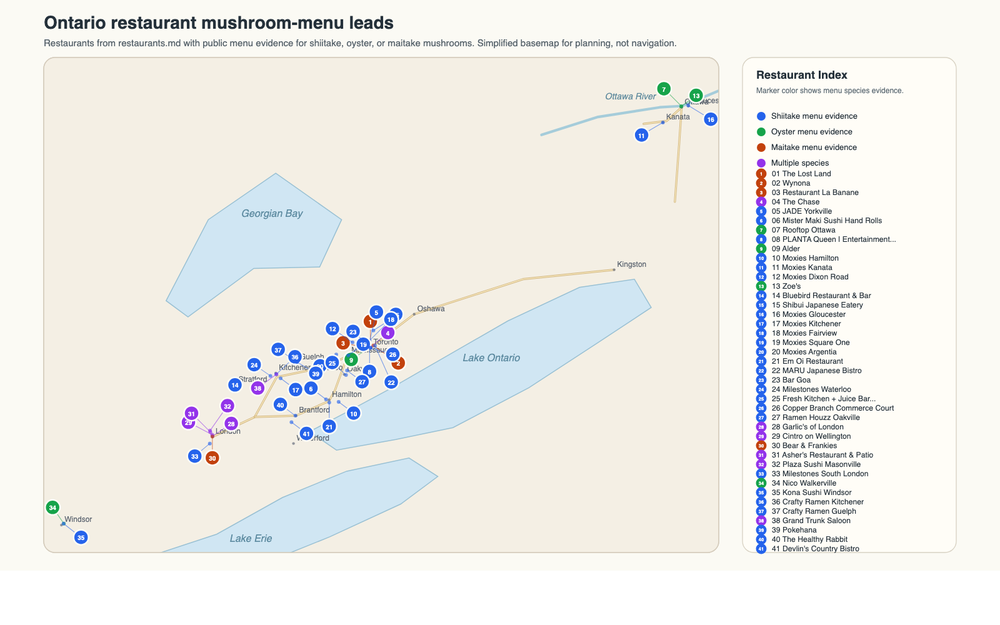

# Ontario Restaurants With Shiitake, Oyster, or Maitake Mushrooms

Initial verification against public menu/contact pages on 2026-04-12. Additional shiitake-focused scan and southwestern Ontario scan added on 2026-04-29. Menus can change seasonally.

## Rough Location Map

Map note: this is an Ontario-only rough map of the restaurant leads in the table below with public menu evidence for shiitake, oyster, or maitake mushrooms. Use it for outreach and delivery planning, not navigation. The point data and published map image are in `resources/`; generator scratch files are written under `../temp/distribution/restaurant-map/`.

| Index | Restaurant                             | Henry's Nooooooooooote                                                                       | Address                                                       | Email                                | Phone               | Matching menu item(s)                                                                                                                                                       | Menu URL                                                                                                                                        | Sources                                                                                                                                                                                                                                                |
| ----- | -------------------------------------- | -------------------------------------------------------------------------------------------- | ------------------------------------------------------------- | ------------------------------------ | ------------------- | --------------------------------------------------------------------------------------------------------------------------------------------------------------------------- | ----------------------------------------------------------------------------------------------------------------------------------------------- | ------------------------------------------------------------------------------------------------------------------------------------------------------------------------------------------------------------------------------------------------------ |
| 1     | The Lost Land                          |                                                                                              | 146 Yonge Street, Toronto, ON M5C 1X6                         | info@thelostland.ca                  | 647-907-7819        | `Fried Maitake`                                                                                                                                                             | [Menu](https://www.thelostland.ca/menu/)                                                                                                        | [Menu](https://www.thelostland.ca/menu/), [FAQ/contact](https://www.thelostland.ca/faq/)                                                                                                                                                               |
| 2     | Wynona                                 |                                                                                              | 819 Gerrard Street East, Toronto, ON M4M 1Y8                  | wynona@wynonatoronto.com             | 416-778-5171        | Menu includes a pork chop with `maitake` and smoked bacon                                                                                                                   | [Menu](https://wynonatoronto.com/)                                                                                                              | [Home/menu](https://wynonatoronto.com/), [Contact](https://wynonatoronto.com/contact-us)                                                                                                                                                               |
| 3     | Restaurant La Banane                   |                                                                                              | 227 Ossington Avenue, Toronto, ON M6J 2Z8                     | info@labanane.ca                     | 416-551-6263        | `roasted maitake mushroom`                                                                                                                                                  | [Menu](https://www.labanane.ca/menu)                                                                                                            | [Menu](https://www.labanane.ca/menu)                                                                                                                                                                                                                   |
| 4     | The Chase                              |                                                                                              | 10 Temperance St Fl 5, Toronto, ON M5H 1Y4                    | info@thechaserg.com                  | 647-348-7000        | `Mushrooms & Artichokes` with chick'n fried `oyster mushrooms`; `Prime Striploin` with `maitake mushrooms`                                                                  | [Menu](https://www.thechasetoronto.com/menu/spring-dinner-menu/)                                                                                | [Menu](https://www.thechasetoronto.com/menu/spring-dinner-menu/), [Contact](https://www.thechasetoronto.com/contact/)                                                                                                                                  |
| 5     | JADE Yorkville                         | they sell shiitake dumpling, probably don't use fresh shiitake                               | 137 Avenue Road, Toronto, ON M5R 2H7                          | reservations@jadeyorkville.com       | 647-368-6998        | `Wagyu Gyoza` with `shiitake` dumplings                                                                                                                                     | [Menu](https://jadeyorkville.com/menu)                                                                                                          | [Menu](https://jadeyorkville.com/menu), [Contact](https://jadeyorkville.com/contact)                                                                                                                                                                   |
| 6     | Mister Maki Sushi Hand Rolls           |                                                                                              | 990 King St W, Hamilton, ON L8S 1L1                           | hello@mistermaki.ca                  | 905-928-9168        | `Seaweed Salad & Shiitake Truffle`                                                                                                                                          | [Menu](https://mistermaki.ca/)                                                                                                                  | [Home/menu](https://mistermaki.ca/), [Contact](https://mistermaki.ca/contact-us/)                                                                                                                                                                      |
| 7     | Rooftop Ottawa                         |                                                                                              | 54 York Street, Ottawa, ON K1N 6Z9                            | info@rooftopottawa.ca                | 613-421-0820        | `mushroom pizzetta` with `yellow oyster mushrooms`; `Atlantic Cod` with `yellow oyster mushrooms`                                                                           | [Menu](https://www.rooftopottawa.ca/menu)                                                                                                       | [Menu](https://www.rooftopottawa.ca/menu)                                                                                                                                                                                                              |
| 8     | PLANTA Queen \| Entertainment District | called 5.1                                                                                   | 180 Queen Street West, Toronto, ON M5V 3X3                    | helloqueen@plantahq.com              | 647-812-1210        | `Beef & Broccoli` with `shiitake 'steak'`; `Tofu Scramble` with pulled `shiitake` steak                                                                                     | [Menu](https://www.plantarestaurants.com/location/planta-queen-toronto/)                                                                        | [Location/Menu](https://www.plantarestaurants.com/location/planta-queen-toronto/)                                                                                                                                                                      |
| 9     | Alder                                  |                                                                                              | 51 Camden St, Toronto, ON M5V 1V2                             | inquire@aldertoronto.com             | 416-637-3737        | `Grilled Short Rib` with `King Oyster Mushroom`                                                                                                                             | [Menu](https://www.aldertoronto.com/contact/)                                                                                                   | [Contact/Menu](https://www.aldertoronto.com/contact/)                                                                                                                                                                                                  |
| 10    | Moxies Hamilton                        | called 5.1 they have centralized vendor process                                              | 560 Centennial Parkway North, Hamilton, ON L8E 0G2            | hamiltongm@moxies.ca                 | 289-389-7224        | `Mushroom Zen Bowl` with crispy `shiitake`; `Miso Ramen` with marinated `shiitake mushrooms`                                                                                | [Menu](https://moxies.com/restaurants/hamilton/menus/)                                                                                          | [Menu](https://moxies.com/restaurants/hamilton/menus/), [Location](https://moxies.com/restaurants/hamilton/)                                                                                                                                           |
| 11    | Moxies Kanata                          |                                                                                              | 601 Earl Grey Drive, Kanata, ON K2T 1K4                       | kanatagm@moxies.ca                   | 613-599-5000        | `Wild Sablefish` with marinated `shiitake`; `Mushroom Zen Bowl` with crispy `shiitake`                                                                                      | [Menu](https://moxies.com/restaurants/kanata/menus/)                                                                                            | [Menu](https://moxies.com/restaurants/kanata/menus/), [Location](https://moxies.com/restaurants/kanata/)                                                                                                                                               |
| 12    | Moxies Dixon Road                      |                                                                                              | 55 Reading Court, Etobicoke, ON M9W 7K7                       | dixonroadgm@moxies.ca                | 416-798-6788        | `Wild Sablefish` with marinated `shiitake`; `Mushroom Zen Bowl` with crispy `shiitake`                                                                                      | [Menu](https://moxies.com/restaurants/etobicoke-dixon-road/menus/)                                                                              | [Menu](https://moxies.com/restaurants/etobicoke-dixon-road/menus/), [Location](https://moxies.com/restaurants/etobicoke-dixon-road/)                                                                                                                   |
| 13    | Zoe's                                  |                                                                                              | Fairmont Chateau Laurier, 1 Rideau Street, Ottawa, ON K1N 8S7 | chateaulaurier@fairmont.com          | 613-241-1414        | `King Oyster Mushroom`; `Mushroom Risotto` with lion's mane and `blue oyster` mushrooms                                                                                     | [Menu](https://www.zoesottawa.com/menu/)                                                                                                        | [Menu](https://www.zoesottawa.com/menu/), [Hotel contact](https://all.accor.com/hotel/A570/index.en.shtml)                                                                                                                                             |
| 14    | Bluebird Restaurant & Bar              |                                                                                              | 30 Ontario Street, Stratford, ON N5A 3G8                      | bluebirdstratford@gmail.com          | 519-271-2255        | `Organic Baby Shiitake Mushrooms`                                                                                                                                           | [Menu](https://www.bluebirdrestaurant.ca/menu)                                                                                                  | [Menu](https://www.bluebirdrestaurant.ca/menu), [Dining listing](https://www.stratfordfestival.ca/Visit/Dining/)                                                                                                                                       |
| 15    | Shibui Japanese Eatery                 | called 5.1, have problem comm with them                                                      | 600 Mt Pleasant Rd, Toronto, ON M4S 2M8                       | shibuieatery@hotmail.com             | 416-322-1000        | `Shiitake maki` with marinated `shiitake mushroom`, cucumber & tempura bits                                                                                                 | [Menu](https://www.shibuieatery.com/menu?menu=sashimi-sushi-maki)                                                                               | [Menu](https://www.shibuieatery.com/menu?menu=sashimi-sushi-maki), [Home/contact](https://www.shibuieatery.com/)                                                                                                                                       |
| 16    | Moxies Gloucester                      |                                                                                              | 1976 Ogilvie Road, Gloucester, ON K1J 9M8                     | gloucestergm@moxies.ca               | 343-505-3956        | `Mushroom Zen Bowl` with crispy `shiitake`; `Miso Ramen` with marinated `shiitake mushrooms`                                                                                | [Menu](https://moxies.com/restaurants/gloucester/menus/)                                                                                        | [Menu](https://moxies.com/restaurants/gloucester/menus/), [Location](https://moxies.com/restaurants/gloucester/)                                                                                                                                       |
| 17    | Moxies Kitchener                       |                                                                                              | 385 Fairway Road S, Kitchener, ON N2C 2N9                     | kitchenergm@moxiesgrill.com          | 519-208-4488        | `Mushroom Zen Bowl` with crispy `shiitake`; `Miso Ramen` with marinated `shiitake mushrooms`                                                                                | [Menu](https://moxies.com/restaurants/kitchener/menus/)                                                                                         | [Menu](https://moxies.com/restaurants/kitchener/menus/), [Location](https://moxies.com/restaurants/kitchener/)                                                                                                                                         |
| 18    | Moxies Fairview                        |                                                                                              | 1800 Sheppard Ave. East, North York, ON M2J 5A7               | fairviewgm@moxies.eatz.ca            | 647-426-6677        | `Mushroom Zen Bowl` with crispy `shiitake`; `Miso Ramen` with marinated `shiitake mushrooms`                                                                                | [Menu](https://moxies.com/restaurants/toronto-fairview-mall/menus/)                                                                             | [Menu](https://moxies.com/restaurants/toronto-fairview-mall/menus/), [Location](https://moxies.com/restaurants/toronto-fairview-mall/)                                                                                                                 |
| 19    | Moxies Square One                      |                                                                                              | 100 City Centre Drive, Mississauga, ON L5B 2C9                | gmsq1@moxiespcl.com                  | 905-276-6555        | `Mushroom Zen Bowl` with crispy `shiitake`; `Miso Ramen` with marinated `shiitake mushrooms`                                                                                | [Menu](https://moxies.com/restaurants/mississauga-square-one/menus/)                                                                            | [Menu](https://moxies.com/restaurants/mississauga-square-one/menus/), [Location](https://moxies.com/restaurants/mississauga-square-one/)                                                                                                               |
| 20    | Moxies Argentia                        | called 5.1. centralized system                                                               | 2959 Argentia Road, Mississauga, ON L5N 0A2                   | gmarg@moxiespcl.com                  | 905-567-5511        | `Mushroom Zen Bowl` with crispy `shiitake`; `Miso Ramen` with marinated `shiitake mushrooms`                                                                                | [Menu](https://moxies.com/restaurants/mississauga-argentia/menus/)                                                                              | [Menu](https://moxies.com/restaurants/mississauga-argentia/menus/), [Location](https://moxies.com/restaurants/mississauga-argentia/)                                                                                                                   |
| 21    | Em Oi Restaurant                       | called 5.1, owner is not here, call back sunday                                              | 542 Upper Wellington St, Hamilton, ON L9A 3P5                 | Not publicly listed                  | 905-387-4582        | `Cha Gio Chay Vegetarian Spring Roll` with `shiitake mushrooms`                                                                                                             | [Menu](https://emoirestaurants.ca/)                                                                                                             | [Home/menu/contact](https://emoirestaurants.ca/)                                                                                                                                                                                                       |
| 22    | MARU Japanese Bistro                   |                                                                                              | 1402 Queen Street E, Unit B, Toronto, ON M4L 1C9              | Not publicly listed                  | 416-466-4666        | `Salmon Pressed Sushi` with `Shiitake Mushroom`                                                                                                                             | [Takeout menu](https://www.marubistro.com/menus)                                                                                                | [Takeout menu](https://www.marubistro.com/menus), [Contact/menu](https://www.marubistro.com/menu)                                                                                                                                                      |
| 23    | Bar Goa                                | called 5.1, email them. email is something like management.bargoa@gmail.com                  | 36 Toronto St., Toronto, ON M5C 2C5                           | Contact form only                    | 416-866-8316        | Vegetarian omakase `Chai & Cutlet` with chanterelle, porcini, and `shiitake mushroom` in galouti kebab                                                                      | [Omakase menu](https://www.bargoa.ca/menu/main/)                                                                                                | [Menu](https://www.bargoa.ca/menu/main/), [Hours/location](https://www.bargoa.ca/location/bar-goa/), [Contact form](https://www.bargoa.ca/contact/)                                                                                                    |
| 24    | Milestones Waterloo                    | called 5.1, to call back in an hour                                                          | 410 The Boardwalk, Waterloo, ON N2T 0A6                       | Contact form only                    | 519-579-4949        | `Shiitake Teriyaki Bowl`; noodle/ramen items with `shiitake mushrooms` or roasted `shiitake`                                                                                | [Menu](https://milestonesrestaurants.com/menus/waterloo/)                                                                                       | [Menu](https://milestonesrestaurants.com/menus/waterloo/), [Location](https://milestonesrestaurants.com/locations/waterloo/), [Ingredient guide](https://milestonesrestaurants.com/wp-content/uploads/2025/11/Core-Ingredient-Listing-November-25.pdf) |
| 25    | Fresh Kitchen + Juice Bar Oakville     |                                                                                              | 215 Lakeshore Road East, Oakville, ON L6J 1H7                 | Contact form only                    | 905-845-8219        | `Crispy Dumplings` with spinach, `shiitake` and pine nut                                                                                                                    | [Menu](https://www.freshkitchens.ca/en/menu/lunch-dinner.html)                                                                                  | [Menu](https://www.freshkitchens.ca/en/menu/lunch-dinner.html), [Location](https://www.freshkitchens.ca/en/locations/on/oakville/215-lakeshore-road-east)                                                                                              |
| 26    | Copper Branch Commerce Court           | called 5.1                                                                                   | 199 Bay Street, Commerce Court, Toronto, ON M5L 1E2           | Contact form only                    | 416-792-2982        | `Shiitake Teriyaki Burger`; power bowls offer `Shiitake Teriyaki` as a protein option                                                                                       | [Menu](https://eatcopperbranch.com/menu/)                                                                                                       | [Menu](https://eatcopperbranch.com/menu/), [Location](https://eatcopperbranch.com/fr/restaurants/commerce-court/), [Contact form](https://eatcopperbranch.com/contact/)                                                                                |
| 27    | Ramen Houzz Oakville                   |                                                                                              | 511 Maple Grove Dr, Oakville, ON L6J 4W3                      | Not publicly listed                  | 289-813-2912        | `Vegetarian Shio Ramen` with `shiitake mushrooms`                                                                                                                           | [Menu item](https://ramenhouzzoakville.com/location/oakville/313-vegetarian-shio-ramen/)                                                        | [Menu item/location](https://ramenhouzzoakville.com/location/oakville/313-vegetarian-shio-ramen/)                                                                                                                                                      |
| 28    | Garlic's of London                     |                                                                                              | 481 Richmond Street, London, ON N6A 3E4                       | dine@garlicsoflondon.com             | 519-432-4092        | `Mushroom Sourdough Flatbread` with roasted `Shogun Maitake Mushrooms`; salmon with sauteed `shogun maitake mushrooms`; duck breast with tempura `oyster mushrooms`         | [Dinner menu](https://garlicsoflondon.com/menu/Dinner%20menu)                                                                                   | [Dinner menu](https://garlicsoflondon.com/menu/Dinner%20menu), [Lunch menu](https://garlicsoflondon.com/menu/lunch-menu-copy)                                                                                                                          |
| 29    | Cintro on Wellington                   |                                                                                              | 731 Wellington Street, London, ON N6A 3S1                     | Contact form/listing email link only | 519-639-8658        | Londonlicious menu listed `Crispy Shogun Maitake`; `Mushroom Toast` with fried `Shogun Maitake` and soy `shiitake` duxelle                                                  | [Londonlicious PDF menu](https://www.cintro.ca/uploads/b/c8abe000-b32c-11ee-bbde-4beb050b0da3/Lunch%20Cintro%20Menu%20londonliclous_NDY5NT.pdf) | [Menu PDF](https://www.cintro.ca/uploads/b/c8abe000-b32c-11ee-bbde-4beb050b0da3/Lunch%20Cintro%20Menu%20londonliclous_NDY5NT.pdf), [Tourism London listing/contact](https://www.londontourism.ca/cintro-on-wellington)                                 |
| 30    | Bear & Frankies                        |                                                                                              | 130 King Street, London, ON N6A 1C5                           | info@bearandfrankies.ca              | 519-914-3606        | Londonlicious menu listed spaghetti vegan bolognese with `shogun maitake mushroom`, walnut, and fennel                                                                      | [Londonlicious dinner menu](https://www.bearandfrankies.ca/londonlicious)                                                                       | [Dinner menu/contact](https://www.bearandfrankies.ca/londonlicious), [Lunch menu](https://www.bearandfrankies.ca/londonlicious-lunch)                                                                                                                  |
| 31    | Asher's Restaurant & Patio             |                                                                                              | 551 Windermere Road, London, ON N5X 2T1                       | Not publicly listed                  | 519-675-5535        | Londonlicious `Mushroom Arancini` with dried `shiitake` dashi and crispy local `Shogun Maitake`                                                                             | [Londonlicious dinner menu](https://londonlicious.ca/directory-menus/listing/ashers-restaurant-patio/)                                          | [Menu/location](https://londonlicious.ca/directory-menus/listing/ashers-restaurant-patio/)                                                                                                                                                             |
| 32    | Plaza Sushi Masonville                 |                                                                                              | 60 N Centre Road, London, ON N5X 3W1                          | Not publicly listed                  | Not publicly listed | Londonlicious menu listed `Maitake Salmon` and `Shiitake Seaweed Salad`                                                                                                     | [Londonlicious menu](https://londonlicious.ca/directory-menus/listing/plaza-sushi-masonville/)                                                  | [Menu/location](https://londonlicious.ca/directory-menus/listing/plaza-sushi-masonville/)                                                                                                                                                              |
| 33    | Milestones South London                |                                                                                              | 3169 Wonderland Road S, London, ON N6L 1R4                    | Contact form only                    | 519-649-7997        | Londonlicious lunch menu listed `Shiitake Teriyaki Bowl` with pulled `shiitake mushrooms`                                                                                   | [Londonlicious lunch menu](https://londonlicious.ca/directory-menus/listing/milestones-south-london/)                                           | [Menu/location](https://londonlicious.ca/directory-menus/listing/milestones-south-london/)                                                                                                                                                             |
| 34    | Nico Walkerville                       |                                                                                              | 325 Devonshire Road, Windsor, ON                              | Not publicly listed                  | Not publicly listed | `Tempura Oyster Mushroom` with garlic aioli, chestnut aioli, and fresh truffle                                                                                              | [Menu](https://www.nicotaverna.com/nico-walkerville-325-devonshire-road-windsor)                                                                | [Menu/location](https://www.nicotaverna.com/nico-walkerville-325-devonshire-road-windsor)                                                                                                                                                              |
| 35    | Kona Sushi Windsor                     |                                                                                              | 1801 Wyandotte Street East, Windsor, ON N8Y 1E2               | info@konasushi.com                   | 519-997-4638        | `Shiitake Mushroom` maki roll                                                                                                                                               | [Menu](https://www.konasushi.com/menu/)                                                                                                         | [Menu](https://www.konasushi.com/menu/), [Windsor location](https://www.konasushi.com/windsor/), [Contact](https://www.konasushi.com/contact/)                                                                                                         |
| 36    | Crafty Ramen Kitchener                 |                                                                                              | 276 King Street W, Suite 5, Kitchener, ON N2G 1B6             | Contact form only                    | 519-340-2721        | `Meat Lover 2.0` and `Spicy Negi` with pickled `shiitake`; `Veggie Gyoza` made with tempeh and `shiitake mushrooms`; Korean fried chicken with pickled `shiitake mushrooms` | [Menu](https://craftyramen.com/pages/restaurants)                                                                                               | [Menu/locations](https://craftyramen.com/pages/restaurants), [Contact](https://craftyramen.com/pages/contact)                                                                                                                                          |
| 37    | Crafty Ramen Guelph                    |                                                                                              | 17 Macdonell Street, Guelph, ON N1H 2Z4                       | Contact form only                    | 519-340-2701        | Same restaurant menu as Crafty Kitchener: pickled `shiitake` ramen items, `Veggie Gyoza`, and Korean fried chicken with pickled `shiitake mushrooms`                        | [Menu](https://craftyramen.com/pages/restaurants)                                                                                               | [Menu/locations](https://craftyramen.com/pages/restaurants), [Contact](https://craftyramen.com/pages/contact)                                                                                                                                          |
| 38    | Grand Trunk Saloon                     |                                                                                              | 87 King Street W, Kitchener, ON N2G 1X2                       | info@grandtrunksaloon.com            | 519-578-8282        | `Fun Guy` pizza with cremini, `shiitake` and `oyster mushrooms`                                                                                                             | [Takeout menu](https://order.toasttab.com/online/grand-trunk/item-fun-guy_e54bb940-d1ce-49ce-89e0-ac3813d38413)                                 | [Takeout menu](https://order.toasttab.com/online/grand-trunk/item-fun-guy_e54bb940-d1ce-49ce-89e0-ac3813d38413), [Home/contact](https://www.grandtrunksaloon.com/)                                                                                     |
| 39    | Pokehana                               |                                                                                              | 18 Wilson Street, Unit 2, Guelph, ON N1H 4G5                  | Not publicly listed                  | Not publicly listed | `Tofu & Shiitake` bowl with in-house pickled `shiitake mushrooms`; `Pickled Shiitake Side`                                                                                  | [Menu](https://www.pokehana.ca/)                                                                                                                | [Menu/location](https://www.pokehana.ca/)                                                                                                                                                                                                              |
| 40    | The Healthy Rabbit                     | called 5.1 they use organic shiitake. She ask me to email (the owner checks email every day) | 105 Brant Avenue, Brantford, ON N3T 3H4                       | theHEALTHYrabbit@gmail.com           | 519-900-2912        | `Poke Bowl` with marinated `shiitake mushrooms`                                                                                                                             | [Bowls menu](https://www.healthyrabbit.ca/bowls)                                                                                                | [Bowls menu/contact](https://www.healthyrabbit.ca/bowls), [Tourism Brantford article](https://www.discoverbrantford.ca/en/news/nourish-your-body-and-mind-at-the-healthy-rabbit.aspx)                                                                  |
| 41    | Devlin's Country Bistro                | called 5.1 no one aswer                                                                      | 704 Mt Pleasant Road, Mount Pleasant, ON N0E 1K0              | devlins@devlinscountrybistro.com     | 519-484-2258        | `Vegetarian Tonkatsu Ramen` with cashew-`shiitake` broth and lion's mane mushroom                                                                                           | [Menu](https://www.devlinscountrybistro.com/our-menu)                                                                                           | [Menu/contact](https://www.devlinscountrybistro.com/our-menu)                                                                                                                                                                                          |

## Notes

- `yellow oyster mushrooms` and `oyster mushrooms` were treated as matches for the oyster-mushroom requirement.
- `King Oyster Mushroom` was treated as a match for the oyster-mushroom requirement.
- `Zoe's` uses the parent Fairmont Chateau Laurier hotel email on the official hotel listing rather than a separate restaurant-only email.
- `Bluebird Restaurant & Bar` lists phone/address on its menu page; the public email used here comes from the Stratford Festival dining directory.
- `Not publicly listed` or `Contact form only` means no direct restaurant email was found on the public pages checked during this scan.
- `Milestones Waterloo` and `Copper Branch Commerce Court` are useful proof of shiitake menu demand, but confirm whether their shiitake items are purchased as fresh mushrooms, prepared/processed shiitake products, or centrally supplied chain ingredients before treating them as direct fresh-shiitake prospects.
- Several London additions are Londonlicious or other event-menu leads. Treat them as evidence that the chef/venue has used shiitake, oyster, or maitake recently, then verify current menu status and purchasing route before outreach.
- `Garlic's of London`, `Cintro on Wellington`, `Bear & Frankies`, `Asher's Restaurant & Patio`, and `Plaza Sushi Masonville` explicitly reference Shogun Maitake or local maitake on public menus. That is a strong local demand signal, but it may also indicate an existing supplier relationship.
- Chain or multi-location leads such as `Milestones South London`, `Crafty Ramen`, and `Kona Sushi` may buy centrally or use prepared items. Confirm whether individual locations can buy fresh mushrooms directly.
